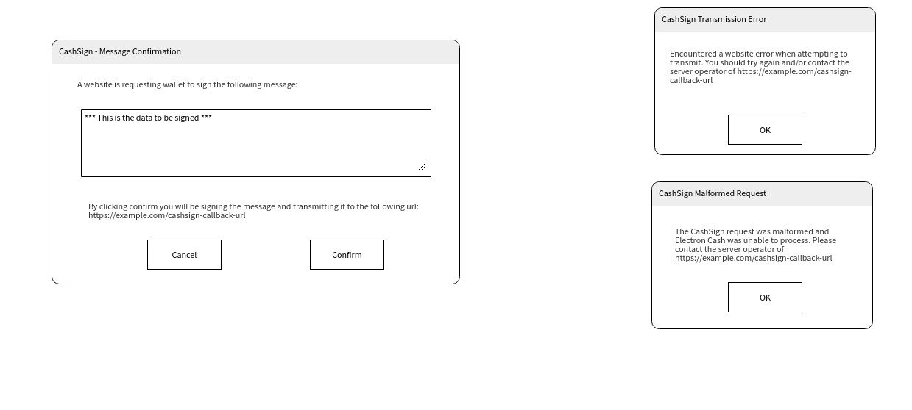
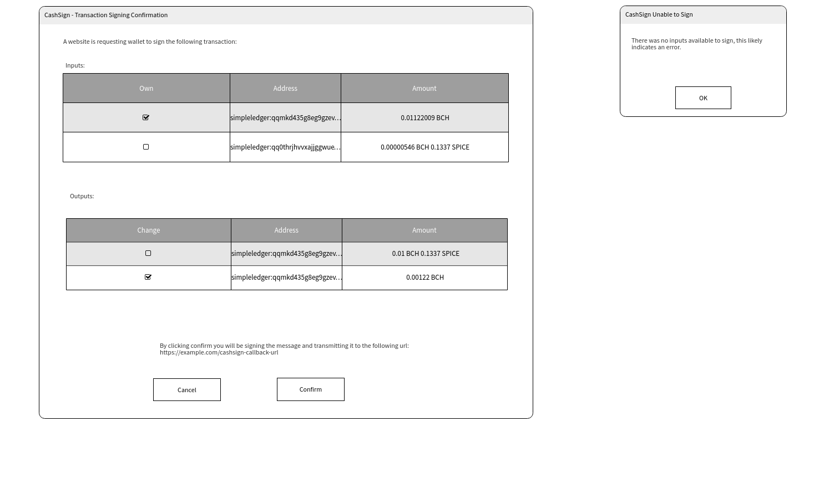

# URI Scheme Specificaton

#### Version: 0.3
#### Date published: 1-18-2019

## Purpose

The purpose of this URI scheme is to enable users to easily make SLP token & Bitcoin Cash payments by simply clicking links on webpages or scanning QR Codes.

## Specification

### General rules for handling (important!)

SLP clients MUST NOT act on URIs without getting the user's authorization.
They SHOULD require the user to manually approve each payment individually, though in some cases they MAY allow the user to automatically make this decision.

### Operating system integration

Graphical SLP clients SHOULD register themselves as the handler for the "simpleledger:" URI scheme by default, if no other handler is already registered. If there is already a registered handler, they MAY prompt the user to change it once when they first run the client.

### General Format

SLP URIs follow the general format for URIs as set forth in RFC 3986. The path component consists of a simpleledger address, and the query component provides additional payment options.

Elements of the query component may contain characters outside the valid range. These must first be encoded according to UTF-8, and then each octet of the corresponding UTF-8 sequence must be percent-encoded as described in RFC 3986.

### ABNF grammar

| Placeholder  | Format                                                       |
| ------------ | ------------------------------------------------------------ |
| slpurn       | = "simpleledger:" [ address / cashsigndata ] [ "?" params ]  |
| address      | = *slpaddr                                                   |
| params       | = param [ "&" params ]                                       |
| param        | = [ amountparam / multiamounts / labelparam / messageparam / otherparam / reqparam / cashsign-type / cashsign-data / cashsign-callbackurl ] |
| amountparam  | = "amount=" *digit [ "." *digit ] [ tokenid ]                |
| multiamounts | = multiamount [ "&" multiamounts ]                           |
| multiamount  | = "amount" *uniquechar "=" *digit [ "." *digit ] [ tokenid ] |
| tokenid      | = "-" 64*hexchar [ "-" tokenflags ]                          |
| tokenflags   | = tokenflag [ "-" tokenflags ]                               |
| tokenflag    | = [ "isgroup" / *qchar ]                                     |
| labelparam   | = "label=" *qchar                                            |
| messageparam | = "message=" *qchar                                          |
| cashsign-type | = [ utf8 / bytes / txn ]                                    |
| cashsign-data | = "0x" *hexchar                                             |
| cashsign-callbackurl | = "https://" *qchar                                  |
| otherparam   | = qchar *qchar [ "=" *qchar ]                                |
| reqparam     | = "req-" qchar *qchar [ "=" *qchar ]                         |

### Implementation Requirements

1. Bitcoin Cash is the blockchain associated with the "simpleledger" URI scheme.
2. If `tokenflags` is omitted the payment shall be made using the tokenid specified.  However, if the `isgroup` tokenflag option is provided then the payment request can satisfied using any valid NFT originating from the NFT group tokenid provided.  Read NFT group specification [here](https://github.com/simpleledger/slp-specifications/blob/master/NFT.md#extension-groupable-supply-limitable-nft-tokens-as-a-derivative-of-fungible-tokens) for more information.  In the future additional `tokenflag` options may be possible.
3. The character set requirements for the `*slpaddr` address format are specified [here](https://github.com/simpleledger/slp-specifications/blob/master/slp-token-type-1.md#slp-addr).

### Examples

This section is non-normative and does not cover all possible syntax.
Please see the BNF grammar above for the normative syntax.

#### Address

* **Just the address:**
  * `simpleledger:qqmtw4c35mpv5rcjnnsrskpxvzajyq3f9ygldn8fj0`

* **Address with name:**
    * `simpleledger:qqmtw4c35mpv5rcjnnsrskpxvzajyq3f9ygldn8fj0?label=Satoshi-Nakamoto`

* **Request 10.0001 XYZ tokens to "Satoshi-Nakamoto":**
  * `simpleledger:qqmtw4c35mpv5rcjnnsrskpxvzajyq3f9ygldn8fj0?amount1=10.0001-<xyzTokenID>&label=Satoshi-Nakamoto`

* **Request 20.30 BCH & 1000 XYZ tokens to "Satoshi-Nakamoto":**
  * `simpleledger:qqmtw4c35mpv5rcjnnsrskpxvzajyq3f9ygldn8fj0?amount=20.3&amount2=1000-<xyzTokenID>&label=Satoshi-Nakamoto`

* **Request 50 BCH & 1 ABC token with message:**
  * `simpleledger:qqmtw4c35mpv5rcjnnsrskpxvzajyq3f9ygldn8fj0?amount1=50&amount2=1-<abcTokenID>&label=Satoshi-Nakamoto&message=Donation%20for%20project%20xyz`

* **Request any 1 NFT token from group XYZ (using "isgroup"):**
  * `simpleledger:qqmtw4c35mpv5rcjnnsrskpxvzajyq3f9ygldn8fj0?amount1=1&amount2=1-<xyzGroupID>-isgroup&label=Satoshi-Nakamoto`

* **Some future version that has variables which are (currently) not understood and required and thus invalid:**
  * `simpleledger:qqmtw4c35mpv5rcjnnsrskpxvzajyq3f9ygldn8fj0?req-somethingyoudontunderstand=50&req-somethingelseyoudontget=999`

* **Some future version that has variables which are (currently) not understood but not required and thus valid:**
  * `simpleledger:qqmtw4c35mpv5rcjnnsrskpxvzajyq3f9ygldn8fj0?somethingyoudontunderstand=50&somethingelseyoudontget=999`

#### CashSign

We use `cashsign` in the parameter names in the hope that wallets which do not yet support CashSign will be able to show the user an error message regarding the parameter "cashsign-X" not being supported.

`cashsign-type`: can be message (utf8, bytes) or transaction (txn), more can be added in future

`cashsign-data`: contains the payload, can be a message or a transaction. prefixed with 0x

`cashsign-callbackurl`: url for the wallet to post the signed data back to.

* **Sign arbitrary message**
  * `simpleledger:qqmtw4c35mpv5rcjnnsrskpxvzajyq3f9ygldn8fj0?cashsign-type=message&cashsign-data=0x00001111DEADBEEF9999cashsign-callbackurl=https://example.com/cashsigncallback`

Will allow for user to see this data in wallet:

* Request for signing message (Provide confirmation and cancel box)

* Inform user that this data will be signed and returned to $cashsign-callbackurl

This should be UTF-8 and the message should be shown in a textbox for the user to inspect. 

* **Sign transaction**
  * `simpleledger:qqmtw4c35mpv5rcjnnsrskpxvzajyq3f9ygldn8fj0?cashsign-type=transaction&cashsign-data=0x000000000010101010000000010100fffff&cashsign-callbackurl=https://example.com/cashsigncallback`

  Will allow for user to see a graphical representation of a transaction and be able to sign some or all of the inputs.

* Request for signing transaction (Provide confirmation and cancel box)

* Inform user that the transaction will be signed and returned to $cashsign-callbackurl

* Show a transaction renderer with the following properties:
 * Our own inputs must be colored
 * Our own outputs must be colored similarly
 * Our change should be visible so that users can easily see how much they are actually spending.

## Reference Implementations

### Clients
Electron Cash SLP - WIP

### Libraries
None currently

## CashSign Advice for Implementors

### 
### 
